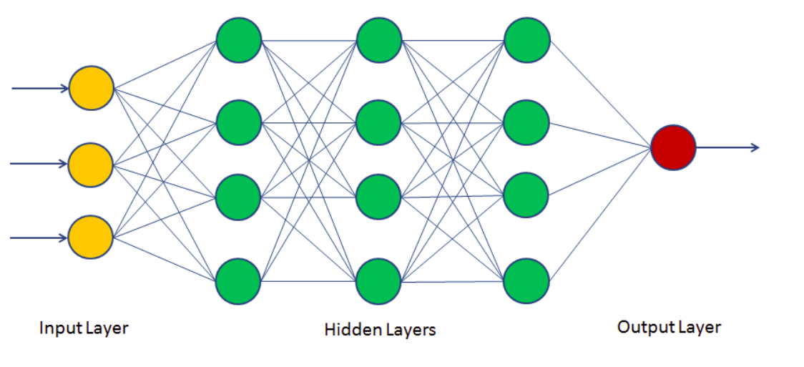
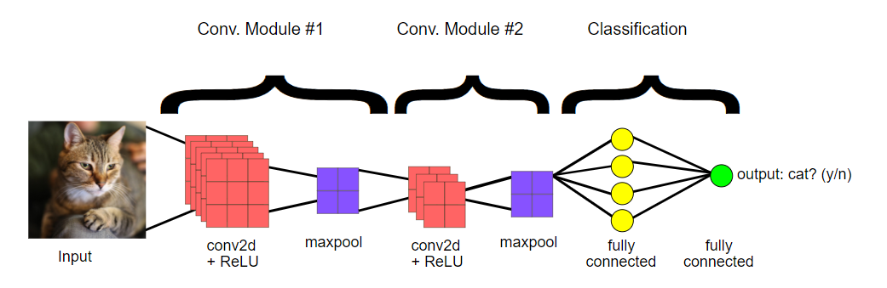
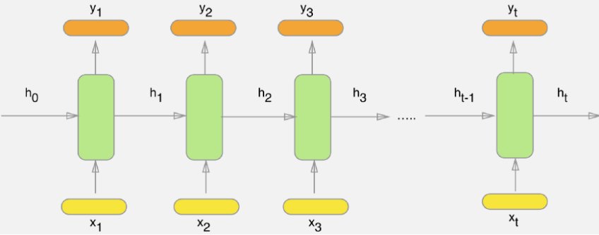

# Neural-Network #

## Implementation of Neural Network using Keras - The Python Deep Learning library ##

### Artificial Neural Network ###

### Convolutional Neural Network ###

### Recurrent Neural Network with LSTM ###

Link to the Dataset -

* ANN - https://drive.google.com/open?id=1lUtV46rwwEpjq34Fgx5SwsZZR50hWg42
* CNN - https://drive.google.com/open?id=1Z1UJmMSlNHRyx5Br1DCRHDZorIDT5F_1
* RNN - https://drive.google.com/open?id=1lUtV46rwwEpjq34Fgx5SwsZZR50hWg42

References -

* ANN -  https://medium.com/@tharanignanasegaram/artificial-neural-network-a-brief-introduction-572d462666f1
* CNN -  https://medium.com/@phidaouss/convolutional-neural-networks-cnn-or-convnets-d7c688b0a207
* RNN - https://colah.github.io/posts/2015-08-Understanding-LSTMs/
